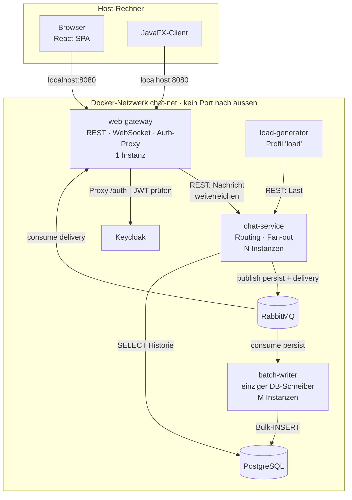
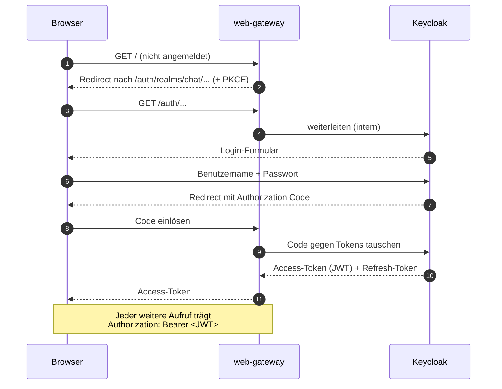
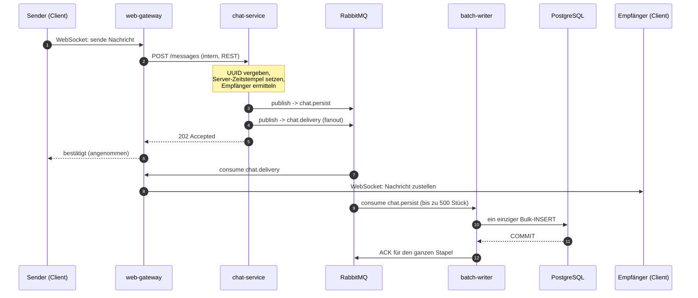
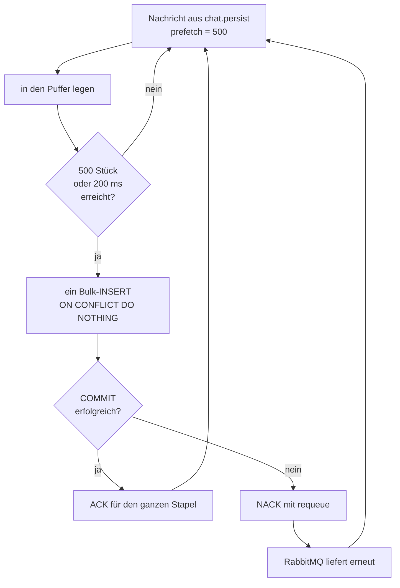
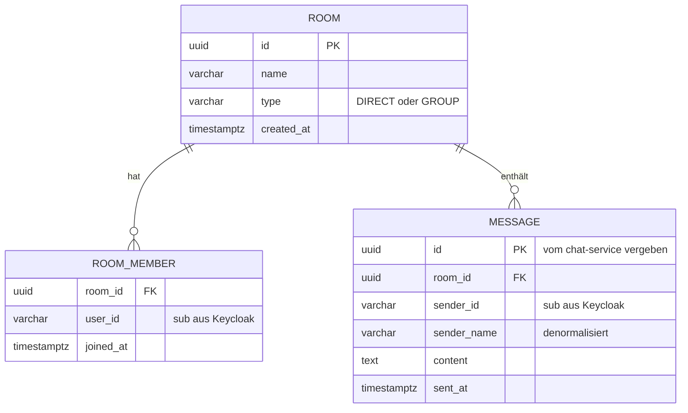

# Chat-App — Planung

**Modul M321 · Klasse IT3c**
**Autor:** Flavio Campigotto
**Planung:** 28.08.2026 · **Überarbeitet:** 18.09.2026

Verteilte Chat-Anwendung als Microservice-Architektur. Vollständig in `docker-compose`
abgebildet, Kommunikation über ein internes Docker-Netzwerk, nur die Web-App ist über
`localhost` erreichbar.

Grundlage: das Flipchart aus der Lektion (`docs/flipchart-chat-app.png`).

> **Woher dieses Dokument kommt.** Es gab zwei Planungen: die Referenzplanung aus dem
> Original-Repository und eine eigene, unabhängig entstandene. Dieses Dokument übernimmt
> den Architekturschnitt der Referenzplanung und arbeitet die Punkte aus der eigenen
> Planung ein, die additiv sind — also nichts am Schnitt ändern, aber eine Lücke
> schliessen. Abschnitt 8 listet jede Übernahme und jede Ablehnung mit Begründung auf.

---

## 1. Auftrag und Rahmenbedingungen

Diese Punkte sind vorgegeben und stehen nicht zur Diskussion:

| Vorgabe | Konsequenz für den Entwurf |
|---|---|
| Java 21 | Spring Boot 3.5 auf allen Java-Diensten |
| Keycloak als Login-Dienst | Kein selbstgebautes Login, kein eigenes Passwort-Handling |
| Message Queues | RabbitMQ als Rückgrat, nicht als Beiwerk |
| Alles in `docker-compose` | Jeder Dienst ist ein Container, ein einziges `up` startet das System |
| Internes Docker-Netzwerk | Dienste sprechen sich über Service-Namen an, nicht über `localhost` |
| **Nur die Web-App über localhost** | Genau **ein** Port-Mapping im ganzen `docker-compose.yml` |

Zusätzliches Ziel aus der Planungsrunde: Die Anwendung soll ein **skaliertes System mit
100'000+ Nachrichten pro Minute** zeigen. Das ist die eigentliche Begründung für die
Queue und für den Batch-Writer — ohne dieses Ziel wäre beides überflüssig.

### 1.1 Wie die Ein-Port-Vorgabe geprüft wird

Die Vorgabe ist ein Abnahmekriterium, kein Nebensatz. Sie ist an zwei Stellen prüfbar:

```bash
# Kommentarzeilen vorher wegwerfen, sonst zählt der Hinweistext mit
grep -v '^[[:space:]]*#' docker-compose.yml | grep -c 'ports:'

docker compose ps          # nur web-gateway zeigt eine Host-Portbindung
```

Heute ergibt der erste Befehl `0` — die Datei bildet Ausbaustufe 1 ab, in der es das
`web-gateway` noch gar nicht gibt. Im Zielbild aus Abschnitt 5.1 ergibt er `1`. Alles
darüber ist ein Fehler.

Das `grep -v` davor ist kein Schönheitsfehler: sowohl die heutige Datei als auch das
Zielbild enthalten einen **Kommentar**, der die Zeichenkette `ports:` erwähnt. Ein
schlichtes `grep -c` zählt ihn mit und meldet einen Port, den es nicht gibt. Eine
Prüfung, die aus dem eigenen Hinweistext ein Ergebnis bastelt, ist schlimmer als keine.

Ein angenehmer Nebeneffekt der Vorgabe: Web-App, API und Keycloak liegen alle unter
derselben Origin `http://localhost:8080`. Damit **entfällt CORS vollständig** — keine
`Access-Control-*`-Header, keine Preflight-Requests, keine CORS-Konfiguration im Gateway
und keine Web-Origins-Liste im Keycloak-Client. Wer Keycloak oder die API zusätzlich nach
aussen öffnet, handelt sich all das ein. Der Aufwand verschwindet nicht, er wandert nur.

---

## 2. Stack

### 2.1 Backend

| Baustein | Wahl | Begründung |
|---|---|---|
| Sprache | Java 21 | Vorgabe |
| Framework | Spring Boot 3.5 | Starter für AMQP, WebSocket, OAuth2 Resource Server, JDBC |
| Message Broker | **RabbitMQ 3.13** | Queues und Exchanges sind am Whiteboard erklärbar, startet in Sekunden |
| Datenbank | **PostgreSQL 16** | Beherrscht Bulk-Inserts und `ON CONFLICT` sauber |
| Schema-Migration | **Flyway** | Versionierte SQL-Dateien statt `ddl-auto`. Siehe Abschnitt 3.8 |
| IDP | **Keycloak 26** | Vorgabe, Realm wird als JSON importiert |
| DB-Zugriff | Spring `JdbcTemplate` | Bewusst **kein** JPA im Batch-Writer: `batchUpdate` ist genau das, was wir zeigen wollen |
| Build | Maven Multi-Modul | Ein `mvn package` baut alle Dienste |
| Tests | JUnit 5 + Testcontainers | Echte RabbitMQ- und Postgres-Container im Test |

### 2.2 Clients

| Client | Technologie | Zweck |
|---|---|---|
| Web | **React 19 + TypeScript + Vite** | Der Hauptclient. Zeigt die saubere Trennung Client / Server |
| Desktop | **JavaFX 21** | Zweiter Client an derselben API. Beweist, dass das Backend clientneutral ist |

Beide Clients sprechen **dieselbe** REST- und WebSocket-Schnittstelle des Gateways.
Es gibt keine Client-spezifische Sonderlogik im Backend.

---

## 3. Architektur

### 3.1 Container-Übersicht



**Der einzige offene Port ist `8080` am `web-gateway`.** Kein anderer Container hat im
`docker-compose.yml` einen `ports:`-Eintrag.

**Bewusste Vereinfachung:** Das Token wird **nur am Gateway** geprüft. Die inneren Dienste
vertrauen dem internen Netz, weil sie von aussen ohnehin nicht erreichbar sind. Das ist ein
gängiges Muster („Gateway als einziger Wachposten"), aber es ist eine Entscheidung und kein
Naturgesetz: sobald ein Dienst einen eigenen Zugang bekäme, müsste er selbst prüfen. Der
Ausbauweg wäre, `chat-service` ebenfalls als OAuth2 Resource Server zu konfigurieren — der
JWKS-Endpunkt von Keycloak ist im internen Netz erreichbar.

Keycloak bringt seine eigene Datenhaltung mit und benutzt unsere `chat`-Datenbank nicht.

### 3.2 Warum Keycloak hinter dem Gateway liegt

Beim OpenID-Connect-Login wird der **Browser** zu Keycloak umgeleitet. Der Browser läuft
aber auf dem Host und erreicht das interne Netz nicht. Damit stehen zwei Wege offen:

1. Keycloak einen eigenen Port geben — verletzt die Vorgabe.
2. Keycloak vom Gateway durchreichen lassen unter `localhost:8080/auth` — ein Port,
   echter Authorization Code Flow mit PKCE.

**Gewählt: Weg 2.** Keycloak läuft mit drei Umgebungsvariablen, und alle drei sind nötig:

| Variable | Wert | Was passiert ohne sie |
|---|---|---|
| `KC_HTTP_RELATIVE_PATH` | `/auth` | Keycloak antwortet unter `/`, das Gateway leitet aber `/auth/**` weiter — alle internen Links zeigen ins Leere |
| `KC_HOSTNAME` | `http://localhost:8080/auth` | Keycloak baut seine URLs aus dem *internen* Namen. Der Token-Aussteller (`iss`) lautet dann `http://keycloak:8080/...`, der Browser bekommt Redirects auf eine Adresse, die er nicht erreicht |
| `KC_PROXY_HEADERS` | `xforwarded` | Keycloak ignoriert `X-Forwarded-Proto` und `X-Forwarded-Host` und hält die Anfrage für direkt |

> **Verifikation vor dem ersten Feature.** Sobald Keycloak steht, diesen Aufruf machen:
>
> ```bash
> curl -s http://localhost:8080/auth/realms/chat/.well-known/openid-configuration | grep issuer
> ```
>
> Steht dort `http://localhost:8080/auth/realms/chat` — gut. Steht dort `keycloak:8080`,
> stimmt `KC_HOSTNAME` nicht, und der Login scheitert später mit einer Meldung, die auf
> alles Mögliche hindeutet, nur nicht auf die Ursache. Siehe offener Punkt 11.

> Verworfen wurde der Resource-Owner-Password-Grant. Er käme ohne Proxy aus, weil kein
> Browser-Redirect nötig ist — dafür müsste unsere Anwendung das Passwort des Benutzers
> entgegennehmen. Genau das soll ein IDP verhindern.

### 3.3 Login-Ablauf

Realm `chat` mit zwei Clients, beide **Public Client** mit Authorization Code + PKCE:

| Client | Redirect-URI | Warum kein Secret |
|---|---|---|
| `chat-web` | `http://localhost:8080/*` | Eine SPA liefert ihren Code an den Browser aus. Ein Secret darin wäre öffentlich |
| `chat-desktop` | `http://127.0.0.1:*/callback` | Eine ausgelieferte Desktop-Anwendung kann kein Geheimnis sicher speichern |



Das Gateway prüft den JWT als **OAuth2 Resource Server** gegen den öffentlichen
Schlüssel von Keycloak (JWKS). Das passiert lokal im Speicher — kein Netzwerkaufruf pro
Anfrage.

**Der Desktop-Client benutzt denselben Flow, aber einen anderen Rückweg** (RFC 8252,
„OAuth 2.0 for Native Apps"):

1. Die App startet einen kurzlebigen HTTP-Listener auf `http://127.0.0.1:<freier Port>`.
2. Sie öffnet den **System-Browser** auf der Keycloak-Login-Seite unter
   `localhost:8080/auth/...`, mit `redirect_uri` auf genau diesen Loopback-Port.
3. Der Benutzer meldet sich im Browser an — die App sieht das Passwort nie.
4. Keycloak leitet auf `http://127.0.0.1:<Port>/callback?code=...` zurück, der Listener
   nimmt den Code entgegen und beendet sich.
5. Die App tauscht den Code mit ihrem PKCE-Verifier gegen Tokens.

Dass der Desktop-Client den Browser auf `localhost:8080` schickt, ist genau der Grund,
warum die Ein-Port-Vorgabe ihn nicht ausschliesst: er benutzt denselben Port wie die
Web-App. Erprobt ist das noch nicht, siehe offener Punkt 4.

### 3.4 Nachrichtenfluss

Der Kern des ganzen Projekts: **Zustellung und Speicherung sind entkoppelt.** Die
Nachricht ist beim Empfänger, bevor sie in der Datenbank steht.

**Das Gateway spricht auf dem Sendeweg nicht mit RabbitMQ.** Es nimmt die Nachricht über
WebSocket entgegen und reicht sie intern per REST an den `chat-service` weiter. Erst der
`chat-service` legt etwas in eine Queue. Damit gibt es genau **eine** Stelle im System, die
Nachrichten annimmt und die Regeln kennt — das Gateway bleibt reiner Übersetzer zwischen
WebSocket und interner API.

Auf dem *Rückweg* ist das Gateway sehr wohl an RabbitMQ: es konsumiert `chat.delivery`, um
seine verbundenen Clients zu bedienen. Das Gateway ist also **Consumer, aber kein Producer**.



### 3.5 Queues und Exchanges

Der einzige Erzeuger ist der `chat-service`. Es gibt **keine** Eingangs-Queue — der
Sendeweg läuft per REST ins `chat-service`, nicht über den Broker.

| Name | Typ | Erzeuger | Verbraucher | Zweck |
|---|---|---|---|---|
| `chat.persist` | Queue | chat-service | batch-writer (M) | Schreibpfad in die DB, Competing Consumers |
| `chat.delivery` | Exchange (fanout) | chat-service | web-gateway | Zustellpfad an die Clients |
| `chat.dlq` | Queue | RabbitMQ | — | Dead Letter, nach 3 fehlgeschlagenen Versuchen |

Jede `web-gateway`-Instanz bindet eine **eigene, exklusive** Queue an
`chat.delivery`. Grund: eine WebSocket-Verbindung hängt an genau einer Instanz, also
muss jede Instanz jede Nachricht sehen und selbst entscheiden, ob einer ihrer
verbundenen Clients sie braucht.

An `chat.persist` hängen dagegen **alle** `batch-writer`-Instanzen an derselben Queue —
jede Nachricht geht an genau einen von ihnen. Das ist das Muster **Competing Consumers**
und die Stelle, an der Skalierung im Unterricht messbar wird.

> **Warum Fanout und nicht Topic.** Ein Topic Exchange mit Routing-Key
> `chat.room.<roomId>` wäre sparsamer: RabbitMQ würde nur an die Gateways liefern, die
> den Raum tatsächlich brauchen. Der Preis ist beweglicher Zustand — jedes Gateway müsste
> bei jedem Verbinden und Trennen eines Clients Bindings anlegen und wieder abräumen, und
> es müsste dafür wissen, in welchen Räumen dieser Client Mitglied ist. Diese Auskunft
> gibt erst die Datenbank, die in Schritt 4 dazukommt. Fanout ist dümmer, aber
> zustandslos, und bei einer Handvoll Gateway-Instanzen kostet das Mitlesen nichts.
> Der Wechsel ist als offener Punkt 14 festgehalten.

### 3.6 Batch-Writer und At-least-once



Das ist **At-least-once**: bestätigt wird erst nach dem COMMIT. Stürzt der Writer
mitten im Stapel ab, liefert RabbitMQ alles erneut — es geht nichts verloren, aber es
können Duplikate entstehen.

Dagegen hilft die UUID, die der `chat-service` vergibt: die Spalte `message.id` ist
Primärschlüssel, `ON CONFLICT DO NOTHING` verwirft das Duplikat beim Einfügen. Wir
behaupten damit **kein** Exactly-once — wir stellen nur sicher, dass Duplikate keinen
Schaden anrichten.

**Der `batch-writer` ist der einzige Dienst, der in die Datenbank schreibt.** Diese Regel
ist der Grund, warum das Mengengerüst aufgeht, und sie gilt auch für Kleinigkeiten: Jede
künftige Schreiboperation — Raum anlegen, Mitglied hinzufügen, Gelesen-Status setzen —
muss entweder ebenfalls über eine Queue laufen oder die Regel bewusst brechen. Das ist
keine Formalie, sondern der offene Punkt 13.

### 3.7 Datenmodell



Benutzer werden **nicht** in unserer Datenbank verwaltet — dafür ist Keycloak da. Wir
speichern nur die `sub`-Kennung und den Anzeigenamen, damit die Chat-Historie lesbar
bleibt, auch wenn ein Konto später gelöscht wird.

**Ein Modell für beide Chat-Arten.** `room.type` unterscheidet `DIRECT` und `GROUP`. Ein
1:1-Chat ist schlicht ein Raum mit `type = DIRECT` und genau zwei Mitgliedern — es
braucht keine zweite Tabelle, keinen zweiten Zustellweg und keine Sonderbehandlung im
`chat-service`. Der Unterschied liegt allein in der Anzeige: die Oberfläche zeigt bei
`DIRECT` den Namen des Gegenübers statt den Raumnamen. Gruppenräume kosten damit
praktisch keinen Mehraufwand.

Index: `message(room_id, sent_at DESC)` — das ist die einzige Abfrage im Lesepfad
(„die letzten 50 Nachrichten eines Raums").

**Bewusst noch nicht im Schema:** kein `last_read_at` für Ungelesen-Zähler, kein
`edited_at` für nachträgliches Bearbeiten, keine `app_user`-Tabelle. Alle drei sind
plausibel, aber keine wird in den Schritten 1 bis 7 benutzt, und `CLAUDE.md` verbietet
Vorrats-Abstraktionen. Weil das Schema über Flyway versioniert ist, kostet das Nachrüsten
später genau eine neue Migrationsdatei — das ist billiger als eine Spalte, die ein
halbes Jahr leer bleibt und bei jeder Erklärung mit erklärt werden muss.

### 3.8 Schema-Migration mit Flyway

Das Schema entsteht **nicht** aus Java-Klassen. Es steht als nummerierte SQL-Dateien im
`batch-writer`, und Flyway spielt sie beim Start in der Reihenfolge ihrer Versionsnummer
ein:

```
batch-writer/src/main/resources/db/migration/
├── V1__room_und_message.sql
├── V2__room_member.sql
└── V3__index_message_room_sent_at.sql
```

Drei Gründe, warum das hier kein Luxus ist:

1. **`ddl-auto` passt nicht zum Entwurf.** Es gehört zu JPA, und wir benutzen im
   `batch-writer` bewusst `JdbcTemplate`. Es gibt also gar keine Entity-Klassen, aus
   denen Hibernate ein Schema ableiten könnte.
2. **Der Index ist Teil des Entwurfs.** `message(room_id, sent_at DESC)` steht in
   Abschnitt 3.7, weil er den Lesepfad trägt. In einer Migrationsdatei ist er sichtbar
   und überprüfbar; in einer Annotation wäre er eine Nebenbemerkung.
3. **Mehrere Instanzen starten gleichzeitig.** Bei `--scale batch-writer=2` fahren zwei
   Container zugleich hoch. Flyway nimmt dafür eine Datenbank-Sperre, sodass genau einer
   migriert und der andere wartet. Zwei Hibernate-Instanzen, die gleichzeitig ein Schema
   anlegen wollen, tun das nicht.

Flyway läuft nur im `batch-writer` — dem Dienst, dem die Datenbank gehört. Der
`chat-service` liest die Historie, migriert aber nicht.

---

## 4. Mengengerüst und Skalierung

### 4.1 Die Rechnung

| Grösse | Wert |
|---|---|
| Zielrate | 100'000 Nachrichten / Minute |
| entspricht | **1'667 Nachrichten / Sekunde** |
| Stapelgrösse | 500 Nachrichten oder 200 ms |
| daraus folgt | **~3,3 Bulk-Inserts / Sekunde** statt 1'667 Einzel-Inserts |
| Ersparnis | Faktor **500** weniger Datenbank-Transaktionen |
| Datenvolumen | ~200 Byte/Nachricht → ~20 MB/min → **~1,2 GB/Stunde** |

Der letzte Wert ist der unangenehme: die Datenbank wächst schnell. Das ist ein offener
Punkt (siehe Abschnitt 7), kein gelöstes Problem.

### 4.2 Skalierung im Unterricht sichtbar machen

```bash
# Grundsystem starten
docker compose up -d

# Last erzeugen (eigenes Profil, damit es nicht immer mitläuft)
docker compose --profile load up -d load-generator

# und jetzt live dazuschalten
docker compose up -d --scale chat-service=3 --scale batch-writer=2
```

Die beiden Dienste skalieren dabei auf **unterschiedlichen Wegen**, und dieser Unterschied
ist selbst Lehrstoff:

- **`batch-writer`** hängt an der Queue `chat.persist`. Alle Instanzen teilen sich dieselbe
  Queue, RabbitMQ verteilt reihum, jede Nachricht geht an genau einen Verbraucher. Das ist
  **Competing Consumers** — Lastverteilung durch den Broker, exakt und ohne Zutun.
- **`chat-service`** wird per REST aufgerufen. Die Lastverteilung übernimmt hier das
  DNS von Docker Compose: der Name `chat-service` löst auf mehrere Container-Adressen auf.
  Das funktioniert, ist aber **ungenauer** — ein HTTP-Client mit Verbindungspool merkt sich
  gern die erste Adresse und schickt dann alles dorthin. Gegenmittel: Keep-Alive im Client
  begrenzen oder die Auflösung pro Anfrage erzwingen (siehe offener Punkt 8).

Genau das ist der Preis der Entscheidung, den Sendeweg per REST zu führen statt über eine
Eingangs-Queue: Der saubere, im Betrieb sichtbare Skalierungseffekt bleibt am
`batch-writer` — und der ist für die 100k/min-Geschichte ohnehin die interessantere Stelle.

Damit man den Effekt *sieht*, holt das Gateway die Queue-Tiefe intern über die
RabbitMQ-Management-API und zeigt sie in der React-App als Balken an. Schaltet man eine
Instanz dazu, sinkt der Balken vor der Klasse. Die Management-Oberfläche selbst bleibt
geschlossen — die Vorgabe „nur die Web-App" gilt auch für bequeme Werkzeuge.

---

## 5. Projektstruktur

```
it3c-m321/
├── docker-compose.yml          # alle Container, genau EIN ports:-Eintrag
├── .env.example                # Beispielwerte, echte Secrets nur lokal
├── CLAUDE.md                   # Projektregeln (Sprache, Code-Stil)
├── PLANUNG.md                  # dieses Dokument
├── pom.xml                     # Maven-Elternprojekt
├── docs/
│   ├── flipchart-chat-app.png
│   └── design/                 # HTML-Fassung dieses Dokuments
├── keycloak/
│   └── realm-chat.json         # Realm, Clients und Testbenutzer als Import
├── web-gateway/                # Spring Boot: REST, WebSocket, Auth, Proxy
├── chat-service/               # Spring Boot: Routing, Fan-out, Historie
├── batch-writer/               # Spring Boot: einziger DB-Schreiber, Flyway-Migrationen
├── load-generator/             # Spring Boot: Lasterzeuger
├── desktop-client/             # JavaFX
└── web-ui/                     # React + TypeScript + Vite
```

Das React-Projekt wird im Docker-Build des Gateways gebaut (mehrstufiges Dockerfile) und
in dessen statische Ressourcen kopiert. So bleibt es bei einem einzigen Container mit
einem einzigen Port.

**Jeder Dienst hat seine eigenen DTO-Klassen.** Es gibt bewusst kein `common`-Modul mit
geteilten Datenklassen: es würde die Dienste über Modulgrenzen hinweg koppeln, und eine
Änderung am DTO müsste dann in allen Diensten gleichzeitig nachgezogen werden — das
Gegenteil dessen, was eine Microservice-Architektur zeigen soll. Die paar doppelten
`record`-Zeilen sind der billigere Preis.

### 5.1 docker-compose — Zielbild

Die Datei im Repository bildet immer nur die **aktuelle Ausbaustufe** ab und wächst mit
den Schritten aus Abschnitt 6 mit. So sieht sie am Ende aus:

```yaml
services:

  web-gateway:                        # der einzige Dienst mit einem Port
    build:
      context: .
      dockerfile: web-gateway/Dockerfile
    ports:
      - "8080:8080"                   # ← der EINZIGE ports:-Eintrag im System
    environment:
      RABBITMQ_HOST: rabbitmq
      RABBITMQ_USER: ${RABBITMQ_USER}
      RABBITMQ_PASSWORD: ${RABBITMQ_PASSWORD}
      CHAT_SERVICE_URL: http://chat-service:8080
      KEYCLOAK_ISSUER_URI: http://localhost:8080/auth/realms/chat
      KEYCLOAK_JWK_SET_URI: http://keycloak:8080/auth/realms/chat/protocol/openid-connect/certs
    depends_on:
      rabbitmq:
        condition: service_healthy
      keycloak:
        condition: service_started     # siehe offener Punkt 12
    networks:
      - chat-net

  chat-service:
    build:
      context: .
      dockerfile: chat-service/Dockerfile
    environment:
      RABBITMQ_HOST: rabbitmq
      RABBITMQ_USER: ${RABBITMQ_USER}
      RABBITMQ_PASSWORD: ${RABBITMQ_PASSWORD}
      POSTGRES_HOST: postgres
      POSTGRES_USER: ${POSTGRES_USER}
      POSTGRES_PASSWORD: ${POSTGRES_PASSWORD}
    depends_on:
      rabbitmq:
        condition: service_healthy
      postgres:
        condition: service_healthy
    networks:
      - chat-net

  batch-writer:                       # einziger DB-Schreiber, spielt die Migrationen ein
    build:
      context: .
      dockerfile: batch-writer/Dockerfile
    environment:
      RABBITMQ_HOST: rabbitmq
      RABBITMQ_USER: ${RABBITMQ_USER}
      RABBITMQ_PASSWORD: ${RABBITMQ_PASSWORD}
      POSTGRES_HOST: postgres
      POSTGRES_USER: ${POSTGRES_USER}
      POSTGRES_PASSWORD: ${POSTGRES_PASSWORD}
    depends_on:
      rabbitmq:
        condition: service_healthy
      postgres:
        condition: service_healthy
    networks:
      - chat-net

  load-generator:                     # läuft nur mit --profile load
    build:
      context: .
      dockerfile: load-generator/Dockerfile
    profiles:
      - load
    environment:
      CHAT_SERVICE_URL: http://chat-service:8080
    depends_on:
      - chat-service
    networks:
      - chat-net

  rabbitmq:
    image: rabbitmq:3.13-management
    environment:
      RABBITMQ_DEFAULT_USER: ${RABBITMQ_USER}
      RABBITMQ_DEFAULT_PASS: ${RABBITMQ_PASSWORD}
    healthcheck:
      test: ["CMD", "rabbitmq-diagnostics", "-q", "ping"]
      interval: 5s
      timeout: 5s
      retries: 12
    networks:
      - chat-net

  postgres:
    image: postgres:16-alpine
    environment:
      POSTGRES_DB: chat
      POSTGRES_USER: ${POSTGRES_USER}
      POSTGRES_PASSWORD: ${POSTGRES_PASSWORD}
    volumes:
      - pgdata:/var/lib/postgresql/data
    healthcheck:
      test: ["CMD-SHELL", "pg_isready -U ${POSTGRES_USER} -d chat"]
      interval: 5s
      timeout: 5s
      retries: 12
    networks:
      - chat-net

  keycloak:
    image: quay.io/keycloak/keycloak:26.0
    command: start-dev --import-realm
    environment:
      KC_HTTP_RELATIVE_PATH: /auth
      KC_HOSTNAME: http://localhost:8080/auth
      KC_PROXY_HEADERS: xforwarded
      KC_BOOTSTRAP_ADMIN_USERNAME: ${KEYCLOAK_ADMIN}
      KC_BOOTSTRAP_ADMIN_PASSWORD: ${KEYCLOAK_ADMIN_PASSWORD}
    volumes:
      - ./keycloak/realm-chat.json:/opt/keycloak/data/import/realm-chat.json:ro
    networks:
      - chat-net

# Nur web-gateway hat oben ein Port-Mapping. Prüfbefehl siehe Abschnitt 1.1.
networks:
  chat-net:
    name: chat-net

volumes:
  pgdata:
```

**Zwei Regeln, die in dieser Datei stecken:**

1. **Kein `expose:`.** In einem User-defined Network erreichen sich alle Container auf
   allen Ports — `expose` ändert daran nichts, es ist reine Dokumentation. Was von aussen
   erreichbar ist, entscheidet allein `ports:`. Wer `expose` für einen Schutz hält, baut
   auf Sand.
2. **`depends_on` allein reicht nicht.** Es wartet nur darauf, dass der Container
   *gestartet* ist, nicht dass der Dienst darin *antwortet*. Postgres und RabbitMQ
   brauchen deshalb einen `healthcheck` und die abhängigen Dienste
   `condition: service_healthy`. Ohne das startet der `batch-writer` schneller als die
   Datenbank und stirbt beim ersten Verbindungsversuch.

Jede neue Umgebungsvariable kommt mit Beispielwert in `.env.example`. Die echte `.env`
steht in `.gitignore`.

---

## 6. Umsetzungsreihenfolge

| # | Schritt | Ergebnis | Warum in dieser Reihenfolge |
|---|---|---|---|
| 1 | Gerüst | `docker-compose.yml` mit RabbitMQ, Postgres, Keycloak; Maven-Elternprojekt | Ohne laufende Infrastruktur kann niemand etwas testen |
| 2 | Login | Keycloak-Realm, Gateway mit Proxy und JWT-Prüfung, React zeigt den Benutzernamen | Auth zuerst, sonst wird es später nachträglich eingebaut und ist dann falsch |
| 3 | Ein Weg durch | Nachricht vom Browser bis zum zweiten Browser, ohne Datenbank | Der kürzeste Weg zu etwas Sichtbarem |
| 4 | Persistenz | `batch-writer` mit Flyway-Migrationen und Bulk-Insert, Historie beim Öffnen eines Raums | Jetzt ist der Nutzen der Entkopplung erklärbar |
| 5 | Last | `load-generator`, Queue-Tiefe in der Oberfläche | Erst jetzt gibt es etwas zu messen |
| 6 | Skalieren | `--scale`, Competing Consumers, Messreihe | Der eigentliche Lernstoff von M321 |
| 7 | Desktop | JavaFX-Client an derselben API | Kür — beweist die Clientneutralität |

Schritt 3 ist der wichtigste Meilenstein. Alles davor ist Vorbereitung, alles danach ist
Ausbau.

**Stand heute:** Schritt 1 steht bis auf Postgres (die kommt erst in Schritt 4, weil erst
der `batch-writer` sie braucht). Der `chat-service` aus Schritt 3 ist gebaut und getestet.

**Schritt 2 ist geschrieben, aber noch nie gelaufen.** Vorhanden sind der Keycloak-Realm
als Import, das `web-gateway` mit Token-Prüfung und Weiterleitung von `/auth/**`, und eine
React-App, die den angemeldeten Benutzer anzeigt. Die Tests dazu sind grün — sie prüfen
aber nur die Teile, die ohne Keycloak auskommen: die Weiterleitung gegen eine Attrappe,
das Auslesen eines erfundenen Tokens, die PKCE-Rechnung gegen das Beispiel aus RFC 7636.

Was noch aussteht, ist der erste echte Anmeldevorgang: `docker compose up`, im Browser
anmelden, und sehen ob der Name erscheint. Genau dort entscheiden sich die offenen
Punkte 11 und 12, und dort ist auch mit dem ersten Fehlschlag zu rechnen.

---

## 7. Offene Punkte

Ehrlich benannt, nicht weggeschwiegen. Die Spalte **Art** trennt drei Sorten: *zu klären*
muss vor dem Weiterbauen entschieden werden, *Risiko* kostet beim Bauen Zeit, wenn man es
nicht kennt, *zurückgestellt* ist bewusst aufgeschoben.

Die Nummern 1 bis 9 stammen aus der Referenzplanung und bleiben unverändert, weil
`docs/plan-chat-service.md` auf sie verweist.

| # | Punkt | Art | Stand | Möglicher Weg |
|---|---|---|---|---|
| 1 | **Gateway skaliert nicht** | zurückgestellt | Eine WebSocket-Verbindung klebt an einer Instanz. Bei `--scale web-gateway=2` landen zwei Clients auf zwei Instanzen und der Port ist mehrfach vergeben | nginx als Lastverteiler davor, mit Sticky Sessions. Wäre ein achter Container — bewusst zurückgestellt |
| 2 | **Datenbank wächst um 1,2 GB/Stunde** | zurückgestellt | Ungelöst | Partitionierung nach Tag, oder ein Aufräum-Job, der Nachrichten älter als X löscht |
| 3 | **Reihenfolge der Nachrichten** | zu klären | Bei N `chat-service`-Instanzen ist die Reihenfolge innerhalb eines Raums nicht garantiert | Entweder über den `room_id`-Hash konsistent auf eine Instanz routen, oder im Client nach `sent_at` sortieren. Zweiteres ist einfacher und für einen Chat gut genug |
| 4 | **Login im JavaFX-Client** | zurückgestellt | Konzept steht (Abschnitt 3.3), nicht erprobt | System-Browser öffnen, Rückleitung auf `http://127.0.0.1:<zufälliger Port>/callback` (RFC 8252). Der Client speichert kein Passwort |
| 5 | **Keycloak-Admin-Oberfläche** | zurückgestellt | Nicht erreichbar, das ist so gewollt | Realm kommt als JSON-Import. Für Änderungen im Unterricht: `docker compose exec` oder eine dokumentierte `docker-compose.override.yml`, die den Port nur temporär öffnet |
| 6 | **Rechte und Rollen** | zu klären | Noch nicht entschieden | Vorschlag: Keycloak-Rollen `user` und `admin`; nur `admin` sieht die Queue-Tiefe. Offen bleibt die Ebene darunter: darf jedes Mitglied eines `GROUP`-Raums weitere Leute einladen, oder nur der Ersteller? Falls nur der Ersteller, braucht `room_member` eine Rolle — und damit eine Flyway-Migration |
| 7 | **Wirklich 100k/min auf einem Laptop?** | Risiko | Unbewiesen | Muss gemessen werden. Realistischer Engpass ist RabbitMQ mit persistenten Nachrichten, nicht die Datenbank. Fällt die Messung schlecht aus, ist das ein Ergebnis und kein Misserfolg |
| 8 | **Lastverteilung auf `chat-service`** | Risiko | Durch den REST-Sendeweg entstanden | Docker-DNS verteilt auf mehrere Instanzen, aber ein HTTP-Client mit Verbindungspool umgeht das. Keep-Alive begrenzen oder pro Anfrage neu auflösen. Muss gemessen werden, sonst glaubt man an eine Verteilung, die nicht stattfindet |
| 9 | **Kein Puffer auf dem Sendeweg** | Risiko | Bewusst in Kauf genommen | Ist der `chat-service` überlastet oder unten, schlägt das Senden sofort fehl — es gibt keine Queue, die das auffängt. Der Client muss das sichtbar machen („Nachricht nicht gesendet") statt sie stillschweigend zu verlieren. Ausbauweg wäre eine Eingangs-Queue, also genau die Variante, die wir verworfen haben |
| 10 | **Token-Erneuerung bei offener WebSocket-Verbindung** | zu klären | Ungelöst | Ein Access-Token läuft typischerweise nach 5 Minuten ab, eine Chat-Verbindung steht länger. Wird die Verbindung beim Ablauf getrennt und neu aufgebaut, oder reicht der Client ein frisches Token über den bestehenden Socket nach? Zweiteres ist angenehmer, erfordert aber eine eigene Nachrichtenart im WebSocket-Protokoll |
| 11 | **Keycloak hinter dem Proxy** | Risiko | Konfiguration steht in Abschnitt 3.2, nicht erprobt | `KC_HOSTNAME` falsch gesetzt heisst: der `iss` im Token lautet `keycloak:8080`, das Gateway erwartet `localhost:8080`, und der Login scheitert mit einer nichtssagenden Meldung. **Vor dem ersten Feature** die `.well-known`-URL aufrufen und den `issuer` prüfen |
| 12 | **Keycloak-Startzeit und Health-Endpunkt** | Risiko | Im Zielbild steht `condition: service_started` | Keycloak braucht ~30 s bis es antwortet, und sein Health-Endpunkt liegt auf dem getrennten Management-Port 9000 — ein Healthcheck ist deshalb nicht in einer Zeile geschrieben. Gegenmittel im Gateway: `jwk-set-uri` statt `issuer-uri` konfigurieren. `issuer-uri` holt die OIDC-Konfiguration **beim Start** und lässt das Gateway scheitern, wenn Keycloak noch nicht da ist; `jwk-set-uri` holt den Schlüssel erst bei der ersten Anfrage |
| 13 | **Wer schreibt ausser dem `batch-writer`?** | zu klären | Regel steht, Ausnahmen nicht geprüft | Raum anlegen, Mitglied hinzufügen, später Gelesen-Status: das sind seltene Schreiboperationen, für die ein Bulk-Writer überdimensioniert ist. Entweder eine zweite, kleine Queue mit demselben Consumer, oder die Regel für Verwaltungsdaten bewusst brechen und begründen. Nicht stillschweigend entscheiden |
| 14 | **Topic-Routing statt Fanout** | zurückgestellt | Fanout ist gewählt, Begründung in Abschnitt 3.5 | Sobald die Datenbank in Schritt 4 steht, weiss das Gateway, in welchen Räumen seine Clients Mitglied sind. Dann liesse sich `chat.delivery` auf Topic mit `chat.room.<roomId>` umstellen. Gewinn: weniger Verkehr. Preis: Bindings bei jedem Verbinden und Trennen pflegen |
| 15 | **Anzeigenamen in Raumlisten** | zu klären | Lücke im Datenmodell | `message.sender_name` ist denormalisiert, `room_member` hat nur die `sub`-Kennung. Für „wer ist in diesem Raum" fehlt also der Name. Entweder ebenfalls denormalisieren, oder über die Keycloak-Admin-API nachschlagen. Ersteres passt besser zur Entscheidung, keine Benutzer in unserer DB zu führen |
| 16 | **TLS** | zurückgestellt | Lokal läuft alles über HTTP | Das Gateway ist die einzige Stelle, an der TLS später ergänzt würde — ohne Änderung an den inneren Diensten. Dass es genau einen Eingang gibt, macht das billig |
| 17 | **Umfang des Desktop-Clients** | zu klären | Nicht festgelegt | Voller Funktionsumfang oder erst nur Lesen und Senden ohne Raumverwaltung? Schritt 7 ist Kür — die kleinere Variante beweist die Clientneutralität genauso |

Am dringendsten sind Punkt 3 (Reihenfolge der Nachrichten), Punkt 11 (Keycloak-`iss`, weil
er Schritt 2 blockiert) und Punkt 7 (ob 100k/min auf einem Laptop überhaupt erreichbar
sind). Punkt 7 lässt sich nicht am Whiteboard klären, sondern erst nach Schritt 5 messen.

---

## 8. Abweichungen von der Referenzplanung

Dieses Dokument folgt dem Architekturschnitt der Referenzplanung. Aus der eigenen Planung
wurde nur übernommen, was **additiv** ist: eine Lücke schliessen, ohne den Schnitt
anzufassen. Alles andere ist hier mit Begründung abgelehnt — auch das ist ein Ergebnis.

### 8.1 Übernommen

| Was | Wo | Warum es additiv ist |
|---|---|---|
| **Flyway statt `ddl-auto`** | 2.1, 3.8, 5, 6 | Die Referenzplanung sagt kein Wort zu Schema-Migration — eine echte Lücke. `ddl-auto` passt hier ohnehin nicht, weil der `batch-writer` `JdbcTemplate` statt JPA benutzt und es gar keine Entity-Klassen gibt. Zusätzlich löst Flyway ein Problem, das bei `--scale batch-writer=2` sonst auftritt: zwei gleichzeitig startende Instanzen |
| **`room.type` = `DIRECT` \| `GROUP`** | 3.7 | Die Referenzplanung behandelt 1:1-Chats gar nicht. Eine Spalte genügt, um beide Chat-Arten mit **einem** Modell abzudecken — kein zweiter Zustellweg, keine Sonderbehandlung im `chat-service`. Das ist kein Vorrat, sondern ein Merkmal, das ab Schritt 3 benutzt wird |
| **Konkretes `docker-compose.yml`-Zielbild** | 5.1 | Die Referenzplanung hatte nur einen Verzeichnisbaum. Ein Verzeichnisbaum ist nicht prüfbar, eine Compose-Datei schon — und sie ist die Vorgabe, an der die Abgabe gemessen wird |
| **Healthchecks als Pflicht, `depends_on` als Falle** | 5.1, Punkt 12 | `depends_on` wartet auf den Containerstart, nicht auf Betriebsbereitschaft. Ohne `condition: service_healthy` stirbt der `batch-writer` beim ersten Verbindungsversuch. Kostet nichts, spart einen Nachmittag |
| **`KC_HOSTNAME` und die `iss`-Verifikation** | 3.2, Punkt 11 | Die Referenzplanung nennt nur `KC_HTTP_RELATIVE_PATH` und `KC_PROXY_HEADERS`. Ohne `KC_HOSTNAME` stimmt der Token-Aussteller nicht, und der Fehler zeigt sich erst beim Login — mit einer Meldung, die woanders hinzeigt. Der `curl`-Einzeiler prüft das in fünf Sekunden |
| **Das CORS-Argument** | 1.1 | Die Ein-Port-Vorgabe wirkte bisher wie eine Einschränkung. Sie ist auch eine Vereinfachung: eine Origin heisst kein CORS. Das macht die Vorgabe vom Hindernis zum Vorteil und erklärt nebenbei, warum „Keycloak zusätzlich exponieren" teurer ist, als es aussieht |
| **Prüfbares Abnahmekriterium für den einen Port** | 1.1 | Zwei Befehle, die die wichtigste Vorgabe des Auftrags nachweisen. Vorher stand die Vorgabe nur als Behauptung im Text |
| **Der Desktop-Login ausformuliert** | 3.3 | In der Referenzplanung ist das offener Punkt 4 mit zwei Sätzen. Der Ablauf ist aber bekannt (RFC 8252) und in fünf Schritten beschreibbar. Er bleibt offener Punkt, weil er *nicht erprobt* ist — das ist etwas anderes als *nicht durchdacht* |
| **Keycloak-Clients benannt** | 3.3 | `chat-web` und `chat-desktop`, beide Public Client mit PKCE, mit Begründung warum kein Secret. Die Referenzplanung erwähnt nur „Realm wird importiert". Beim Schreiben von `realm-chat.json` in Schritt 2 braucht man genau diese Angaben |
| **TLS als benannter Ausbauweg** | Punkt 16 | Einzeiler, schliesst eine Frage, die in jeder Besprechung kommt |
| **Offene Punkte nach Art kategorisiert** | 7 | „Muss ich das entscheiden, bevor ich weiterbaue?" ist eine andere Frage als „was kostet mich das beim Bauen?". Eine Spalte trennt beides, ohne die Nummerierung zu zerstören |
| **Punkte 10, 13, 15, 17** | 7 | Vier Lücken, die beim Zusammenführen sichtbar wurden: Token-Ablauf bei offener WebSocket-Verbindung, Ausnahmen von der Einzelschreiber-Regel, fehlende Anzeigenamen in Raumlisten, Umfang des Desktop-Clients |

### 8.2 Geprüft und nicht übernommen

| Was | Warum nicht |
|---|---|
| **Backend schreibt zuerst in die DB, dann publish** | Das ist der Kern, der nicht verhandelbar ist. Die eigene Planung kauft damit Konsistenz (was zugestellt ist, steht sicher im Verlauf) — aber sie bedeutet 1'667 Einzeltransaktionen pro Sekunde und macht Queue und Batch-Writer überflüssig. Genau die sollen hier gezeigt werden. Das Gegenargument ist trotzdem gültig und steht als Trade-off in Abschnitt 3.6 |
| **nginx als Gateway statt Spring Boot** | Der Schnitt ist sauberer (Routing ≠ Fachlogik), scheitert hier aber an einer harten Tatsache: das `web-gateway` ist **AMQP-Consumer** an `chat.delivery` (Abschnitt 3.4) und liest zusätzlich die Queue-Tiefe aus der Management-API. Das kann nginx nicht. Ein nginx davor **und** ein Java-Dienst dahinter wären zwei Container statt einem |
| **Topic Exchange statt Fanout** | Technisch feiner, aber es braucht die Raum-Mitgliedschaften aus der Datenbank, die erst in Schritt 4 existiert, und es tauscht zustandsloses Fanout gegen Bindings, die bei jedem Verbinden und Trennen gepflegt werden müssen. Als offener Punkt 14 festgehalten, nicht verworfen |
| **`app_user`-Tabelle** | Widerspricht der Entscheidung, Identitäten allein in Keycloak zu führen. Sie brächte sofort die Folgefrage mit, wie ein neuer Benutzer dort hineinkommt — eine Frage, die mit Denormalisierung gar nicht erst entsteht. Die echte Lücke dahinter (Anzeigenamen in Raumlisten) ist als Punkt 15 notiert |
| **`common`-Modul mit geteilten DTOs** | Koppelt die Dienste über Modulgrenzen: eine DTO-Änderung müsste überall gleichzeitig nachgezogen werden. Das ist das Gegenteil dessen, was M321 zeigen soll. Begründung steht in Abschnitt 5 |
| **`last_read_at` und `edited_at` im Schema** | Beide werden in keinem der sieben Schritte benutzt. `CLAUDE.md` verbietet Vorrats-Abstraktionen, und weil das Schema jetzt über Flyway läuft, kostet das Nachrüsten genau eine Migrationsdatei. Eine Spalte, die ein halbes Jahr leer bleibt, muss bei jeder Erklärung mit erklärt werden |
| **JWT-Prüfung auch im `chat-service`** | Sicherheitstechnisch besser, aber es macht den `load-generator` tokenpflichtig — dann misst man in Schritt 5 die Token-Prüfung mit statt die Architektur. Die Referenzplanung markiert „Gateway als einziger Wachposten" ausdrücklich als Entscheidung und nennt den Ausbauweg. Der Stand bleibt, die Begründung ist in Abschnitt 3.1 nachlesbar |
| **`expose:` für die inneren Dienste** | Sieht nach Absicherung aus, ist aber keine: in einem User-defined Network erreichen sich alle Container auf allen Ports, unabhängig von `expose`. Es hätte den falschen Eindruck erweckt, die Vorgabe sei damit erfüllt. Begründung in Abschnitt 5.1 |
| **Die nginx-WebSocket-Stolperfalle** (`Upgrade`/`Connection`-Header) | Entfällt mit nginx. Ohne Reverse-Proxy im Sendeweg gibt es keinen Handshake, der an fehlenden Headern scheitern könnte. Sollte Punkt 1 später einen nginx davorstellen, kommt sie zurück |

---

## 9. Verlauf

*Dieser Abschnitt ist von der KI geschrieben und hält fest, wie die Planung tatsächlich
zustande kam — inklusive der Stellen, an denen ich falsch lag.*

### Runde 1 bis 3 — die eigene Planung

Grundlage war das Flipchart: Java 21, UI für Web und Desktop, Login mit einem Fragezeichen
(„Ja/Nein"), Message Queues, dazu die Kästen WEB, MQ, Backend, IDP, DB und Batches. Die
Auftragsvorgaben (Keycloak, docker-compose, internes Netz, nur Web über localhost) kamen
ergänzend dazu und beantworteten die Login-Frage von selbst.

**Runde 1 — drei offene Punkte aus der Skizze:** Welche Oberflächen werden wirklich
gebaut? Welche Message Queue? Nur 1:1 oder auch Gruppen?

Statt direkt zu antworten, kam eine Rückfrage: **warum genau diese drei Broker zur Auswahl
standen.** Daraufhin habe ich die Auswahlkriterien offengelegt (läuft als Container, reifer
Java-Client, Ressourcenbedarf auf einem Laptop, Eignung für Publish/Subscribe mit Räumen,
Dokumentationslage) und die Kandidaten daran gemessen. Das war der nützlichste Moment der
Planung: danach stand die Begründung fest, nicht nur die Entscheidung.

**Runde 2** brachte einen Konflikt, der sich erst aus der Antwort ergab: Wie bekommt die
Desktop-App Zugang, ohne die Ein-Port-Vorgabe zu verletzen? **Runde 3** war eine Rückfrage
zum Aufwand des Gateway-Containers.

**Verworfen wurden:** Kafka (~1 GB Speicher, „ein Topic pro Raum" passt nicht zum
Partitionsmodell), ActiveMQ Artemis (sein Vorteil — STOMP direkt zum Browser — hätte den
Broker nach aussen geöffnet), Redis Pub/Sub (keine Zustellgarantie; und auf dem Flipchart
steht „Message Queues", nicht „Cache"), NATS (im Ausbildungsumfeld selten), ganz ohne
Queue (widerspricht der Skizze und verhindert mehrere Web-Instanzen), Keycloak zusätzlich
exponieren (wären drei offene Ports plus CORS gewesen), Spring Cloud Gateway statt nginx
(~200 MB für reines Weiterleiten), Electron (hätte ein zweites Ökosystem in ein
Java-Projekt geholt).

### Runde 4 — der Vergleich mit der Referenzplanung

Nach der Abgabe kam die Referenzplanung dazu, und der Auftrag lautete: mehrheitlich auf
deren Architektur aufbauen, Stärken der eigenen Planung einarbeiten, wo das einfach geht.

**Was der Vergleich zutage förderte, war unangenehm eindeutig.** Die Referenzplanung
enthält eine Anforderung, die in unserem Gespräch nie vorkam: *„die Applikation soll ein
skaliertes System mit 100k+ Nachrichten pro Minute zeigen"*. In der Referenzplanung heisst
der Absatz dazu „Der Wendepunkt" — vorher war die Queue dort ein Transportweg und Batch
ein nettes Extra, danach war die Queue ein Puffer und der Batch-Writer der einzige Weg in
die Datenbank.

An diesem einen Satz hängen Mengengerüst, Bulk-Insert, Competing Consumers, die
At-least-once-Diskussion, der `load-generator`, die Queue-Tiefe in der Oberfläche und drei
der offenen Punkte. Ohne ihn habe ich den gestrichelten Kasten „Batches" auf dem Flipchart
als das gelesen, wonach er aussieht: als optionales Extra, als Scheduler-Jobs für
Benachrichtigungen und Statistiken.

Bemerkenswert ist, dass die Referenz-KI denselben Fehler gemacht hat. In ihrem eigenen
Abschnitt „Was ich falsch hatte" steht er als Punkt 1. Der Unterschied ist nicht, dass sie
klüger geraten hätte — sie wurde korrigiert, ich nicht. Daraus folgt für mich weniger eine
Lehre über Architektur als eine über das Fragenstellen: Ich hätte bei einem gestrichelten
Kasten nachfragen müssen, was die gestrichelte Linie bedeutet, statt sie zu interpretieren.
Ich habe die naheliegendste Lesart genommen und sie nicht als Annahme gekennzeichnet.

**Das Zusammenführen selbst.** Der Massstab war „additiv oder nicht": Schliesst die
Ergänzung eine Lücke, ohne den Schnitt anzufassen? Elf Punkte haben diesen Test bestanden,
neun nicht. Abschnitt 8 listet beides mit Begründung auf, weil die Ablehnungen genauso
Arbeit waren wie die Übernahmen.

Drei Entscheidungen waren dabei nicht offensichtlich:

1. **nginx als Gateway** schien lange übernehmbar, bis auffiel, dass das `web-gateway` in
   der Referenzarchitektur AMQP-Consumer ist. Das schliesst nginx aus — nicht aus
   Geschmack, sondern weil nginx kein AMQP spricht. Das war der Moment, in dem aus einer
   Geschmacksfrage eine technische wurde.
2. **`last_read_at`** wollte ich zuerst übernehmen; die Spalte kostet ja nichts. Erst der
   Blick in `CLAUDE.md` („Keine Vorrats-Abstraktionen") hat es gekippt — und Flyway, das
   ich im selben Zug eingebaut habe, macht das Argument wasserdicht: Nachrüsten kostet eine
   Datei. Zwei Ergänzungen, die gegeneinander arbeiten, und die Regel hat entschieden.
3. **`expose:`** stand in der eigenen Planung als Beleg dafür, dass die inneren Dienste
   abgeschottet sind. Das stimmt nicht — `expose` ist in einem User-defined Network reine
   Dokumentation. Ich habe es nicht nur weggelassen, sondern die Fehlannahme in Abschnitt
   5.1 benannt, weil sie sonst jemand anders nochmal macht.
4. **Die Prüfung aus Abschnitt 1.1 war zuerst selbst kaputt.** Ich hatte
   `grep -c "ports:" docker-compose.yml` hingeschrieben und „muss 1 ergeben" dazu. Beim
   Nachrechnen auf der echten Datei kam `1` heraus — obwohl dort gar kein Port-Mapping
   steht. Gezählt wurde der Kommentar *„KEIN `ports:`-Eintrag in dieser Datei"*. Die
   Prüfung hätte also genau dann bestanden, wenn nichts da ist, und wäre beim Zielbild auf
   `2` gesprungen. Ein Abnahmekriterium, das man nicht selbst einmal ausführt, ist eine
   Behauptung mit Backticks drumherum.

### Was ich ohne Rückfrage gesetzt habe

Jederzeit änderbar, aber es hat niemand entschieden — ich war es: Flyway-Versionsschema und
Aufteilung in drei Migrationsdateien, Realm-Name `chat`, Client-Namen `chat-web` und
`chat-desktop`, `jwk-set-uri` statt `issuer-uri` als Gegenmittel zur Keycloak-Startzeit,
`condition: service_started` für Keycloak im Compose-Zielbild, die Namen der
Umgebungsvariablen, und die Entscheidung, die Nummerierung der offenen Punkte 1 bis 9
einzufrieren statt sie neu zu sortieren.

Aus der Referenzplanung übernommen, ebenfalls ohne dass es hier zur Debatte stand:
PostgreSQL, Spring Boot, `JdbcTemplate` statt JPA im Batch-Writer, Stapelgrösse 500 /
200 ms, Maven-Multi-Modul, React-Build in das Gateway hinein statt als eigener
nginx-Container.

### Was noch nicht geprüft ist

Nichts aus diesem Dokument wurde gestartet. Das Compose-Zielbild in Abschnitt 5.1 ist
geschrieben, nicht gelaufen — insbesondere der Keycloak-Block mit `KC_HOSTNAME` und dem
Realm-Import ist genau die Stelle, an der ich erwarte, dass die Wirklichkeit widerspricht
(Punkte 11 und 12). Die Flyway-Migrationsdateien aus Abschnitt 3.8 existieren noch nicht,
nur ihre Namen. Die sieben Schritte aus Abschnitt 6 stehen bis auf den `chat-service` aus.

Was tatsächlich läuft, ist der Stand im Repository: `chat-service` mit `POST /messages`,
RabbitMQ-Publisher auf beide Wege, und Tests mit Testcontainers.
